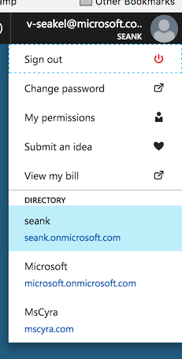

# Active Directory B2C

Walks you through how to deploy an Active Directory B2C directory and prepare it for utilisation in common clients.

## Deploying the Azure AD B2C

1. Create The directory by follow the steps found [here](https://docs.microsoft.com/en-us/azure/active-directory-b2c/active-directory-b2c-get-started).

  *Note: If there are multiple directories in your subscription, you may need to select the directory from the upper right menu before you can complete Step 3.*

  

2. Register your application by following the steps under **Register a web application** found [here](https://docs.microsoft.com/en-us/azure/active-directory-b2c/active-directory-b2c-app-registration).

  In step 5, you will want to specify the Reply URL as follows

for python:  http://localhost:5000/login/authorized
for angular: http://localhost:5000/login/authorized

  In step 8 save the secret that you create, you won't be able to see it later.

3. Create a policy by following the steps for **Create a sign-up or sign-in policy** found [here](https://docs.microsoft.com/en-us/azure/active-directory-b2c/active-directory-b2c-reference-policies).  

  In step 4, use the name **b2c_1_susi**

For usage of the Directory in your app the 
[Python Website](PYTHON.md) 
[Angular Single Page application](SPA.md) 

